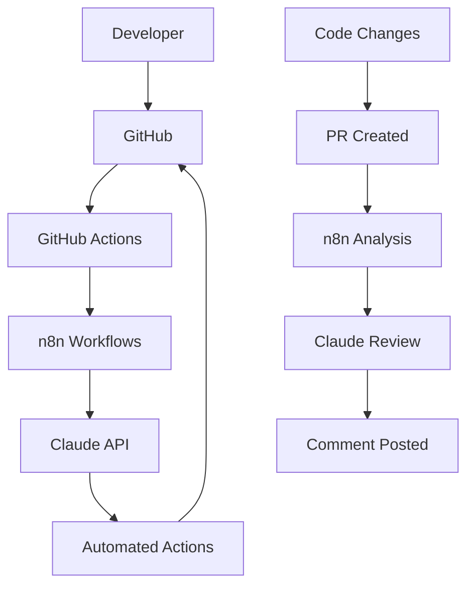

# Claude + GitHub + n8n Integration Workspace

This repository demonstrates the integration of Claude Code, GitHub, and n8n workflow automation to create an intelligent development environment.

## 🚀 Features

- **Automated Code Review**: Claude analyzes pull requests and provides intelligent feedback
- **Smart Documentation**: Automatically updates documentation based on code changes  
- **Issue Triage**: AI-powered categorization and assignment of GitHub issues
- **Workflow Automation**: n8n orchestrates the entire development pipeline

## 🛠️ Quick Setup

### 🔒 Secure Deployment (Recommended)
```bash
# Set required environment variables
export N8N_WEBHOOK_URL="https://your-n8n-instance.com"
export WEBHOOK_SECRET="your-strong-32-char-secret-here"
export GITHUB_TOKEN="ghp_your_github_token"
export ANTHROPIC_API_KEY="sk-your_anthropic_key"

# Run secure deployment
./deploy-secure.sh
```

### ⚡ Basic Setup (Development Only)
```bash
# Run the basic setup (NOT for production)
./setup-integration.sh
```

**Security Features in Secure Deployment:**
- ✅ Webhook signature verification
- ✅ Input validation and sanitization
- ✅ HTTPS enforcement
- ✅ Rate limiting and DDoS protection
- ✅ Real-time security monitoring
- ✅ Content filtering for sensitive data
- ✅ Comprehensive audit logging

## 📋 Manual Setup

### 1. GitHub Repository Setup
```bash
gh repo create claude-github-workspace --public --source=. --push
```

### 2. n8n Workflow Configuration
```bash
# Start n8n
npm run n8n:start

# Import workflows
npm run n8n:import
```

### 3. Configure Webhooks
Add these webhook URLs to your GitHub repository settings:
- **Code Analysis**: `http://your-n8n-instance:5678/webhook/code-analysis`
- **Documentation**: `http://your-n8n-instance:5678/webhook/docs-update`  
- **Issue Triage**: `http://your-n8n-instance:5678/webhook/issue-triage`

## 🔧 Configuration

### 🔐 Required Environment Variables
```bash
# Security (Required)
WEBHOOK_SECRET=your-strong-webhook-secret-min-32-chars
N8N_WEBHOOK_URL=https://your-n8n-instance.com  # MUST be HTTPS

# API Access (Required)  
GITHUB_TOKEN=ghp_your_github_token_here
ANTHROPIC_API_KEY=sk-your_anthropic_api_key_here

# Optional Security Settings
RATE_LIMIT_MAX_REQUESTS=10
MAX_DIFF_SIZE_BYTES=50000
ENABLE_CONTENT_FILTERING=true
```

### 🔑 GitHub Repository Secrets
Auto-configured by deployment script:
- `N8N_WEBHOOK_URL`: Your HTTPS n8n endpoint
- `WEBHOOK_SECRET`: Signature verification secret

### 🏗️ n8n Credentials Setup
Required credentials in n8n:
- **GitHub OAuth2**: Repository access with `repo` and `read:org` scopes
- **Anthropic API**: Claude integration with valid API key

## 🎯 Workflows

### 1. Code Review Assistant
**Trigger**: Pull Request opened/updated
**Actions**:
- Fetches PR diff
- Analyzes code with Claude
- Posts intelligent review comments
- Checks for security issues and best practices

### 2. Documentation Updater  
**Trigger**: Push to main branch
**Actions**:
- Detects documentation-worthy changes
- Updates README and docs automatically
- Maintains changelog
- Commits documentation updates

### 3. Issue Triage System
**Trigger**: New issue created
**Actions**:
- Analyzes issue content with AI
- Auto-labels by category/priority
- Assigns to appropriate team members
- Suggests similar issues or solutions

## 📈 Benefits

- **Reduced Review Time**: Automated initial code analysis
- **Consistent Quality**: AI-powered quality gates
- **Better Documentation**: Always up-to-date project docs
- **Efficient Triage**: Smart issue categorization
- **Learning Tool**: Claude provides educational feedback

## 🔗 Integration Points



This integration creates a seamless development experience where AI assists at every step of the development lifecycle.

## 🛡️ Security

### 🔒 Security Features
- **Webhook Signature Verification**: HMAC-SHA256 signature validation
- **Input Sanitization**: XSS and injection attack prevention
- **Rate Limiting**: DDoS and abuse protection
- **Content Filtering**: Automatic redaction of sensitive data
- **HTTPS Enforcement**: Encrypted communication only
- **Authentication**: Basic auth and JWT support
- **Audit Logging**: Comprehensive security event tracking

### 📊 Security Monitoring
```bash
# Start security monitoring dashboard
node security/monitoring-dashboard.js

# View security logs
tail -f ~/.n8n/logs/security.log

# Check security report
cat ~/.n8n/logs/security-report.json
```

### 🚨 Security Alerts
The system monitors for:
- Failed webhook signature verification
- Unusual network connection patterns
- High CPU/memory usage
- Authentication failures
- Rate limit violations

### 🔧 Security Maintenance
```bash
# Rotate webhook secret (monthly)
export NEW_WEBHOOK_SECRET="new-32-char-secret"
gh secret set WEBHOOK_SECRET --body "$NEW_WEBHOOK_SECRET"

# Update n8n and dependencies
npm update -g n8n

# Review security logs
./security/audit-review.sh
```

### ⚡ Performance & Reliability
- **Auto-retry**: Failed webhook deliveries retry with exponential backoff
- **Timeout Protection**: 30-second request timeouts
- **Resource Limits**: CPU and memory usage monitoring
- **Health Checks**: Automated endpoint health verification

## 🆘 Troubleshooting

### Common Security Issues
1. **Webhook signature validation fails**
   - Verify WEBHOOK_SECRET matches in both GitHub and n8n
   - Check webhook payload format

2. **Rate limiting triggered**
   - Monitor request frequency
   - Adjust RATE_LIMIT_MAX_REQUESTS if needed

3. **n8n authentication failures**
   - Verify credentials in n8n UI
   - Check GitHub token permissions

### Debug Mode
```bash
# Enable debug logging
export N8N_LOG_LEVEL=debug
export SECURITY_DEBUG=true

# Restart with debug mode
./deploy-secure.sh
```
