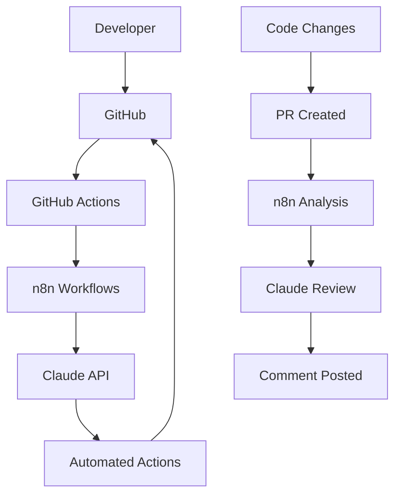

# Claude + GitHub + n8n Integration Workspace

This repository demonstrates the integration of Claude Code, GitHub, and n8n workflow automation to create an intelligent development environment.

## 🚀 Features

- **Automated Code Review**: Claude analyzes pull requests and provides intelligent feedback
- **Smart Documentation**: Automatically updates documentation based on code changes  
- **Issue Triage**: AI-powered categorization and assignment of GitHub issues
- **Workflow Automation**: n8n orchestrates the entire development pipeline

## 🛠️ Quick Setup

```bash
# Run the automated setup
./setup-integration.sh
```

This will:
1. Create/configure the GitHub repository
2. Set up n8n workflows
3. Configure webhook integrations
4. Provide next steps for credential setup

## 📋 Manual Setup

### 1. GitHub Repository Setup
```bash
gh repo create claude-github-workspace --public --source=. --push
```

### 2. n8n Workflow Configuration
```bash
# Start n8n
npm run n8n:start

# Import workflows
npm run n8n:import
```

### 3. Configure Webhooks
Add these webhook URLs to your GitHub repository settings:
- **Code Analysis**: `http://your-n8n-instance:5678/webhook/code-analysis`
- **Documentation**: `http://your-n8n-instance:5678/webhook/docs-update`  
- **Issue Triage**: `http://your-n8n-instance:5678/webhook/issue-triage`

## 🔧 Configuration

### Required Secrets
Add these to your GitHub repository secrets:
- `N8N_WEBHOOK_URL`: Your n8n instance base URL

### n8n Credentials Needed
- **GitHub OAuth2**: For repository access
- **Anthropic API**: For Claude integration

## 🎯 Workflows

### 1. Code Review Assistant
**Trigger**: Pull Request opened/updated
**Actions**:
- Fetches PR diff
- Analyzes code with Claude
- Posts intelligent review comments
- Checks for security issues and best practices

### 2. Documentation Updater  
**Trigger**: Push to main branch
**Actions**:
- Detects documentation-worthy changes
- Updates README and docs automatically
- Maintains changelog
- Commits documentation updates

### 3. Issue Triage System
**Trigger**: New issue created
**Actions**:
- Analyzes issue content with AI
- Auto-labels by category/priority
- Assigns to appropriate team members
- Suggests similar issues or solutions

## 📈 Benefits

- **Reduced Review Time**: Automated initial code analysis
- **Consistent Quality**: AI-powered quality gates
- **Better Documentation**: Always up-to-date project docs
- **Efficient Triage**: Smart issue categorization
- **Learning Tool**: Claude provides educational feedback

## 🔗 Integration Points



This integration creates a seamless development experience where AI assists at every step of the development lifecycle.
